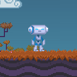

# GodotRecorder
A Godot addon to record frames from in-game footage. It won't create GIFs by itself, but the node will create
images of the content inside it, so you can use those frames with other software to create GIFs.

This is a Game Development helpers tool, and not optimized to be used on the final product (probably). It can still be used
and the code is very readable though, so hopefully it can be easily modified to suit any needs.

## How to install
Simply copy the 'addons' folder to your project and enable it on the 'Addons' tab, on Project Settings.

## Using it
After adding the "Recorder" node to your scene, you can change its size and position to match what you want your frames to record - 
you can even **make it follow a character** by making it a child of the specific scene you want, saving some editting time
afterwards when you create a GIF out of the frames you recorded (**this** is the particular reason I created this node).

To record the frames, while testing your project:
1. Press "R" to start recording the frames.
2. Press "R" to stop recording the frames.
3. Press "S" to save the recorded frames on the 'out/' folder (it'll be created if it doesn't exist) inside your projects folder.

## Script variables and constants
- Frames per second: the number of frames it will save on each second.
- Output folder: the name of the folder inside your Godot project folder the output images are going to be saved (default is 'out').
- Flip Y: Flip the image vertically - since images y axis goes the other way than the engine y axis, this should stay TRUE.
- Use Thread: You can unleash the power of threads to make the game NOT freeze when saving the images after recording.

Inside the script, there are the constants "RECORD_KEY" and "SAVE_KEY", not surprisingly for the respective keys to record and
save the image frames. You can also change them to the key you want to use (default is "R" and "S").

## Known problems

- If the frame is too big, the game might shutter a lot during recording (possibly because image.blit is a very expensive operation, I might investigate that).
- Sometimes the first frame recorded shows the label on the upper-left corner (you can just delete the first frame before creating the GIF).
- Sometimes the label won't show on the game, but the addon works just fine.

## Creating the GIF

If you are on a Linux machine, you can follow those easy instructions: https://askubuntu.com/questions/648244/how-to-create-a-gif-from-the-command-line

You can also use websites to create your gifs: https://giphy.com/create/gifmaker

## Other tools

I created this addon so I could have an in-engine option to create my GIFs - you can also use screen-recording tools (that are probably much more efficient); some of them are listed here:

- https://github.com/phw/peek
- https://trac.ffmpeg.org/wiki/Capture/Desktop
- http://www.screentogif.com/
- https://getsharex.com/

Thanks for the guys at mastodon.gamedev.place for the tips!

## Why creating GIFs for my games is important?

https://www.gamasutra.com/blogs/BundyKim/20160707/276365/Marketing_in_Motion_A_Year_of_Making_Gifs.php
https://www.gamasutra.com/blogs/MattMirrorfish/20160105/263028/Promoting_Your_Game_With_Animated_GIFs.php
https://www.gamasutra.com/blogs/SaraCasen/20170428/297065/How_To_Record_and_Post_GIFs_Showing_Your_Game.php

TLDR: sometimes it can be a lot better than a static image to promote your game.

## License
All addon code is MIT.
